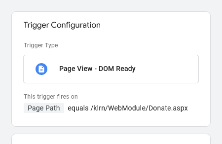
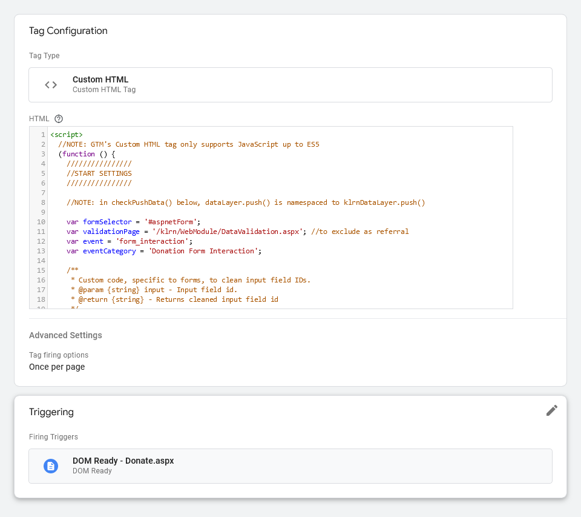

# KLRN Form Interaction Tracker

This is a Custom HTML Tag for Google Tag Manager to track fields filled out on a KLRN TV online donation form, including whether the form initially gets submitted.

When a form's field value changes, the event is tracked along with the form name or category, the field's name or label, and a value for how many fields have been filled out so far. Only a field's first change is tracked.

```
dataLayer.push({
    'event': <event name>,
    'eventCategory': <form name>,
    'eventLabel': <field name>,
    'eventValue': <number of fields filled out so far>
});
```


## Setup

### Google Tag Manager

1 - Under Variables, create three User-Defined Variables called eventCategory, eventLabel and eventValue. For each, the Variable Type should be Data Layer Variable, Version 2. Here's what eventCategory looks like:

<br />

2 - Under Triggers, create a Custom Event trigger called form_interaction that fires on All Custom Events.

<br />

3 - Also under Triggers, create a Page View DOM Ready trigger that fires on the relevant Page Path or other filter.

<br />

4 - Under Tags, create a Google Analytics GA4 Event that links GA4 Event Parameters to Data Layer values. For example, the GA4 parameter `event_category` is matched to the value `{{eventCategory}}`. Set Triggering to the trigger created in step 2.

<br />

5 - Also under Tags, create a Custom HTML Tag and for the HTML field add the script from [custom-html-tag.htm](custom-html-tag.htm). Set Triggering to the trigger created in step 3.

<br />

6 - At the top of the script from [custom-html-tag.htm](custom-html-tag.htm), set variables and edit cleanInputID() to match what's specific to the form being tracked. Also, in checkPushData(), make sure dataLayer.push() is namespaced correctly.

```
////////////////
//START SETTINGS
////////////////

//NOTE: in checkPushData() below, dataLayer.push() is namespaced to klrnDataLayer.push()

var formSelector = '#aspnetForm';
var validationPage = '/klrn/WebModule/DataValidation.aspx'; //to exclude as referral
var event = 'form_interaction';
var eventCategory = 'Donation Form Interaction';

/**
* Custom code, specific to forms, to clean input field IDs.
* @param {string} input - Input field id.
* @return {string} - Returns cleaned input field id
*/
function cleanInputID(input) {
    input = input.split('AllegMain_').slice(-1)[0]; //remove ctl00_AllegMain_ at start
    input = input.replace(/_\d+$/, ''); //remove any underscore followed by digit/s at end
    return input;
}
////////////////
//END SETTINGS
////////////////
```

```
function checkPushData(input) {
    if (inputs.indexOf(input) === -1) {
    inputs.push(input);
    klrnDataLayer.push({
        event: event,
        eventCategory: eventCategory,
        eventLabel: input,
        eventValue: inputs.length - 1, //don't count first item: 'No form inputs'

        //console.log('\nNUMBER OF INPUTS:', inputs.length - 1);
        //console.log('LAST INPUT:', input);
    });
    }
}
```

### Google Analytics 4

1 - Under Admin, Data display, create two custom definitions, named event_category and event_label, and set the scope for both to Event. Also, create a custom metric named event_value, which has to be scoped to Event. Here's what event_category looks like:

<br />

2 - Under Explore, create a Free form report and add event_label to ROWS. Also, add Event count and event_value to VALUES. And under FILTERS, add Event name and set the Condition to exactly matches = form_interaction.

3 - To sort event_labels in the order they appear on a form, download the exploration report to a spreadsheet and re-order the table rows, and optionally add a column of reader-friendly labels and [chart](images/GA4-chart.jpg) the results. To sort labels in the average order users actually filled them out, add a column that divides event_value by Event count and then sort the table using the new column from smallest to largest.

## References

- [Form Abandonment Tracking With Google Tag Manager](https://www.analyticsmania.com/post/form-abandonment-tracking-google-tag-manager/)
- [Tracking Form Abandonments With Google Tag Manager](https://www.getfishtank.com/blog/form-abandonment-tracking-in-google-analytics-4)
- [How to detect all changes to a form with vanilla JavaScript](https://gomakethings.com/how-to-detect-all-changes-to-a-form-with-vanilla-javascript/)
